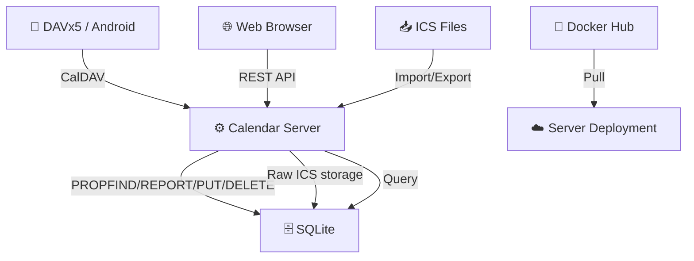

# Calendar — Self-Hosted Calendar with CalDAV Sync

> Go backend + Preact frontend. CalDAV bidirectional sync with DAVx5,  
> ICS import/export fidelity, single-binary deployment. No dependencies at runtime.

[](https://go.dev)
[](LICENSE)
[](https://hub.docker.com/r/brantcoat/calendar)

[中文 README](README_zh-CN.md)

---

## How It Works



1. **CalDAV** — DAVx5 syncs events bidirectionally via standard PROPFIND/REPORT/PUT/DELETE/MKCALENDAR methods.
2. **Web App** — React SPA with custom `MonthGrid` (zero third-party calendar library), dark mode, lunar calendar.
3. **ICS Import/Export** — Raw VEVENT text stored verbatim in `raw_ics` column: VALARM, X-FOSSIFY-*, TRANSP all preserved on round-trip.
4. **Single Binary** — Frontend embedded via `go:embed`. No external web server or CDN needed.

---

## Features

- [x] Docker + single-binary deployment
- [x] Custom-developed `MonthGrid` view
- [x] Built-in support for the Chinese lunar calendar and public holidays
- [x] Event search via `Ctrl+/` shortcut
- [x] High-fidelity ICS support: preserves `VALARM`, `X-FOSSIFY-*`, and `TRANSP`
- [x] CalDAV two-way synchronization (verified on Android using DAVx5)
- [x] Scheduled backups and configuration export
- [x] Light/dark modes and bilingual support (Chinese/English)
- [x] `slog` structured logging (circular buffer, level-based filtering)---

## Quick Start

```bash
# Clone and build
git clone https://github.com/Dichgrem/calendar.git
cd calendar
just build

# Run
./bin/server
```

Visit `http://localhost:3000`. Register an account, then connect DAVx5 to `http://localhost:3000/dav/`.

---

## Docker

```bash
# Pull from Docker Hub
podman pull brantcoat/calendar:latest
podman compose up -d

# Or build locally
just docker-build
```


---

## Environment Variables

| Variable | Default | Description |
|---|---|---|
| `PORT` | `3000` | HTTP listen port |
| `DATABASE_URL` | `./data/calendar.db` | SQLite database path |
| `SECURE_COOKIES` | `false` | Set `true` behind HTTPS |
| `USER_DEFAULT_LANGUAGE` | `zh-CN` | Default UI language |
| `USER_DEFAULT_FIRST_DAY_OF_WEEK` | `1` | Week start (0=Sun, 1=Mon) |
| `USER_DEFAULT_DATE_FORMAT` | `zh` | Date format |
| `USER_DEFAULT_SHOW_LUNAR_CALENDAR` | `true` | Enable lunar calendar |

---

## Commands

```bash
just dev            # Start Go development server
just dev-debug      # Start Go server + Vite HMR + Preact DevTools
just build          # Build frontend + Go binary
just test           # Run Go tests
just lint           # Lint (go vet + biome check + tsc)
just format         # Format (go fmt + biome format)
just docker-build   # Build Docker image
just docker-up      # Docker Compose start
```
---

## 📚 Documentation

| Document | Description |
|----------|-------------|
| [Usage Guide](docs/usage.md) | Desktop & mobile setup, CalDAV pairing, backup/restore |
| [API Reference](docs/api.md) | REST API endpoints, CalDAV protocol, error codes |
| [Developer Guide](docs/dev-guide.md) | Build from source, just commands, frontend HMR |
| [Project Structure](docs/structure.md) | Code layout, packages, architecture decisions |
| [Log System](docs/log.md) | Log levels, debug mode, log viewer |
