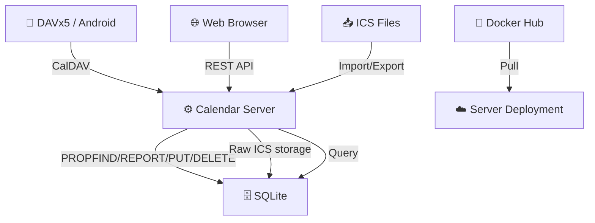

# Calendar — Self-Hosted Calendar with CalDAV Sync

> Go backend + Preact frontend. CalDAV bidirectional sync with DAVx5,  
> ICS import/export fidelity, single-binary deployment. No dependencies at runtime.

[](https://go.dev)
[](LICENSE)
[](https://hub.docker.com/r/brantcoat/calendar)

[中文 README](README_zh-CN.md)

---

## How It Works



1. **CalDAV** — DAVx5 syncs events bidirectionally via standard PROPFIND/REPORT/PUT/DELETE/MKCALENDAR methods.
2. **Web App** — React SPA with custom `MonthGrid` (zero third-party calendar library), dark mode, lunar calendar.
3. **ICS Import/Export** — Raw VEVENT text stored verbatim in `raw_ics` column: VALARM, X-FOSSIFY-*, TRANSP all preserved on round-trip.
4. **Single Binary** — Frontend embedded via `go:embed`. No external web server or CDN needed.

---

## Tech Stack

| Layer | Technology |
|---|---|
| **Backend** | Go + [Chi](https://github.com/go-chi/chi) |
| **Frontend** | Preact (via React compat layer) + Vite + Tailwind CSS |
| **Routing** | React Router v7 |
| **Data Fetching** | TanStack React Query |
| **Calendar Grid** | Custom `MonthGrid` component (CSS Grid 7×6) |
| **CalDAV** | RFC 4791 hand-rolled implementation |
| **ICS Parsing** | [go-ical](https://github.com/emersion/go-ical) |
| **Database** | SQLite ([modernc.org/sqlite](https://modernc.org/sqlite)) |
| **Auth** | PBKDF2 password hashing + secure session cookies |
| **Deployment** | Single Go binary + Docker image |

---

## Features

- [x] CalDAV bidirectional sync (Android DAVx5 tested)
- [x] Custom `MonthGrid` — 226KB bundle (no FullCalendar)
- [x] Full ICS fidelity: VALARM, X-FOSSIFY-*, TRANSP preserved
- [x] Chinese lunar calendar + Chinese holidays
- [x] Dark mode with persistence
- [x] Server log viewer (Debug mode)
- [x] Docker + single-binary deployment
- [x] Structured logging via `slog` (ring buffer, level filtering)

---

## Quick Start

```bash
# Clone and build
git clone https://github.com/Dichgrem/calendar.git
cd calendar
just build

# Run
./bin/server
```

Visit `http://localhost:3000`. Register an account, then connect DAVx5 to `http://localhost:3000/dav/`.

---

## Docker

```bash
# Pull from Docker Hub
podman pull brantcoat/calendar:latest
podman compose up -d

# Or build locally
just docker-build
```


---

## Environment Variables

| Variable | Default | Description |
|---|---|---|
| `PORT` | `3000` | HTTP listen port |
| `DATABASE_URL` | `./data/calendar.db` | SQLite database path |
| `SECURE_COOKIES` | `false` | Set `true` behind HTTPS |
| `USER_DEFAULT_LANGUAGE` | `zh-CN` | Default UI language |
| `USER_DEFAULT_FIRST_DAY_OF_WEEK` | `1` | Week start (0=Sun, 1=Mon) |
| `USER_DEFAULT_DATE_FORMAT` | `zh` | Date format |
| `USER_DEFAULT_SHOW_LUNAR_CALENDAR` | `true` | Enable lunar calendar |

---

## Commands

```bash
just dev            # Start Go development server
just dev-debug      # Start Go server + Vite HMR + Preact DevTools
just build          # Build frontend + Go binary
just test           # Run Go tests
just lint           # Lint (go vet + biome check + tsc)
just format         # Format (go fmt + biome format)
just docker-build   # Build Docker image
just docker-up      # Docker Compose start
```

---

## Project Structure

```
calendar/
├── cmd/server/main.go       # Entry point, router setup
├── internal/
│   ├── auth/                # Auth + sessions + PBKDF2
│   ├── backup/              # Database backup/restore
│   ├── caldav/              # CalDAV protocol (PROPFIND/PUT/DELETE/REPORT/MKCALENDAR)
│   ├── calendar/            # Calendar CRUD
│   ├── config/              # Environment variable loading
│   ├── db/                  # SQLite connection
│   ├── event/               # Event CRUD + override
│   ├── ics/                 # ICS parsing/serialization/routing
│   ├── logger/              # Structured logging (slog + ring buffer)
│   ├── middleware/           # Auth, error, security headers
│   ├── settings/            # User settings
│   ├── sync/                # Sync pull/push
│   └── validate/            # Shared validation
├── web/                     # Preact SPA (pnpm workspace)
│   └── src/
│       ├── components/       # MonthGrid, CalendarView, EventEditor, ImportForm...
│       ├── hooks/            # useEvents, useCalendars, useNav, useSettings...
│       ├── lib/              # date-format, lunar, colors, api client
│       └── pages/            # LoginPage, SettingsPage
├── docs/                    # User & developer documentation
├── Dockerfile
├── Justfile
└── go.mod
```
