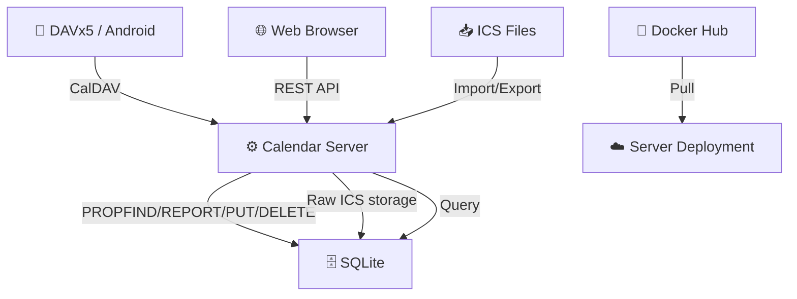

# Calendar — 自托管日历 + CalDAV 双向同步

> Go 后端 + Preact 前端。CalDAV 双向同步 (DAVx5)，ICS 导入/导出保真，单二进制部署。

[](https://go.dev)
[](LICENSE)
[](https://hub.docker.com/r/brantcoat/calendar)

[English README](README.md)

---

## 工作原理



1. **CalDAV** — DAVx5 通过标准 PROPFIND/REPORT/PUT/DELETE/MKCALENDAR 方法双向同步事件。
2. **Web 应用** — Preact SPA 搭配自研 `MonthGrid` 组件（无第三方日历库），支持暗色模式、农历。
3. **ICS 导入/导出** — VEVENT 原文存储于 `raw_ics` 列中：VALARM、X-FOSSIFY-*、TRANSP 等全部原样保留在往返过程中。
4. **单二进制部署** — 前端通过 `go:embed` 嵌入。无需外部 Web 服务器或 CDN。

---

## 技术栈

| 层 | 技术 |
|---|---|
| **后端** | Go + [Chi](https://github.com/go-chi/chi) |
| **前端** | Preact（React 兼容层） + Vite + Tailwind CSS |
| **路由** | React Router v7 |
| **数据获取** | TanStack React Query |
| **日历网格** | 自研 `MonthGrid` 组件（CSS Grid 7×6） |
| **CalDAV** | RFC 4791 手写实现 |
| **ICS 解析** | [go-ical](https://github.com/emersion/go-ical) |
| **数据库** | SQLite ([modernc.org/sqlite](https://modernc.org/sqlite)) |
| **认证** | PBKDF2 密码哈希 + 安全 Session Cookie |
| **部署** | 单 Go 二进制 + Docker 镜像 |

---

## 功能

- [x] CalDAV 双向同步（Android DAVx5 真机测试通过）
- [x] 自研 `MonthGrid` — 226KB 打包体积（无 FullCalendar）
- [x] ICS 完整保真：VALARM、X-FOSSIFY-*、TRANSP 全部保留
- [x] 中国农历 + 节假日
- [x] 暗色模式，状态持久化
- [x] 服务器日志查看器（Debug 模式）
- [x] Docker + 单二进制部署
- [x] slog 结构化日志（环形缓冲区、按级别过滤）

---

## 快速开始

```bash
# 克隆并构建
git clone https://github.com/Dichgrem/calendar.git
cd calendar
just build

# 启动
./bin/server
```

浏览器访问 `http://localhost:3000`。注册账号后，在 DAVx5 中添加 `http://localhost:3000/dav/`。

---

## Docker

```bash
# 从 Docker Hub 拉取
podman pull brantcoat/calendar:latest
podman compose up -d

# 或本地构建
just docker-build
```

---

## 环境变量

| 变量 | 默认值 | 说明 |
|------|--------|------|
| `PORT` | `3000` | HTTP 端口 |
| `DATABASE_URL` | `./data/calendar.db` | SQLite 数据库路径 |
| `SECURE_COOKIES` | `false` | HTTPS 后设为 `true` |
| `USER_DEFAULT_LANGUAGE` | `zh-CN` | 默认语言 |
| `USER_DEFAULT_FIRST_DAY_OF_WEEK` | `1` | 周起始日（0=周日，1=周一） |
| `USER_DEFAULT_DATE_FORMAT` | `zh` | 日期格式 |
| `USER_DEFAULT_SHOW_LUNAR_CALENDAR` | `true` | 显示农历 |

---

## 常用命令

```bash
just dev            # 启动 Go 开发服务器
just dev-debug      # 启动 Go 服务器 + Vite HMR + Preact DevTools
just build          # 构建前端 + Go 二进制
just test           # 运行 Go 测试
just lint           # 代码检查（go vet + biome check + tsc）
just format         # 格式化（go fmt + biome format）
just docker-build   # 构建 Docker 镜像
just docker-up      # Docker Compose 启动
```

---

## 项目结构

```
calendar/
├── cmd/server/main.go       # 入口，路由配置
├── internal/
│   ├── auth/                # 认证 + 会话 + PBKDF2
│   ├── backup/              # 数据库备份/恢复
│   ├── caldav/              # CalDAV 协议（PROPFIND/PUT/DELETE/REPORT/MKCALENDAR）
│   ├── calendar/            # 日历 CRUD
│   ├── config/              # 环境变量读取
│   ├── db/                  # SQLite 连接
│   ├── event/               # 事件 CRUD + override
│   ├── ics/                 # ICS 解析/序列化/路由
│   ├── logger/              # 结构化日志（slog + 环形缓冲区）
│   ├── middleware/           # 认证、错误、安全头
│   ├── settings/            # 用户设置
│   ├── sync/                # 同步 pull/push
│   └── validate/            # 共享校验
├── web/                     # Preact SPA（pnpm workspace）
│   └── src/
│       ├── components/       # MonthGrid, CalendarView, EventEditor, ImportForm...
│       ├── hooks/            # useEvents, useCalendars, useNav, useSettings...
│       ├── lib/              # date-format, lunar, colors, api client
│       └── pages/            # LoginPage, SettingsPage
├── docs/                    # 用户与开发文档
├── Dockerfile
├── Justfile
└── go.mod
```
